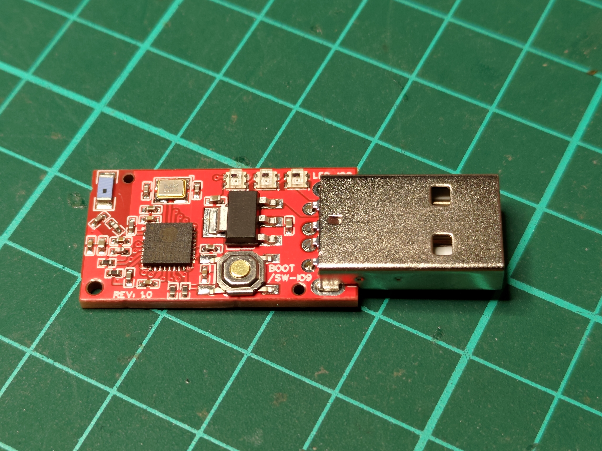
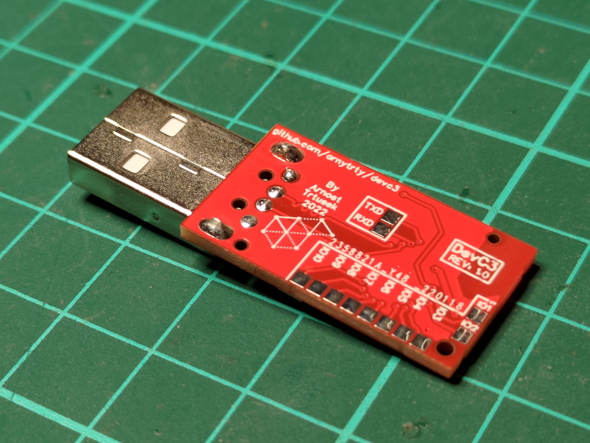
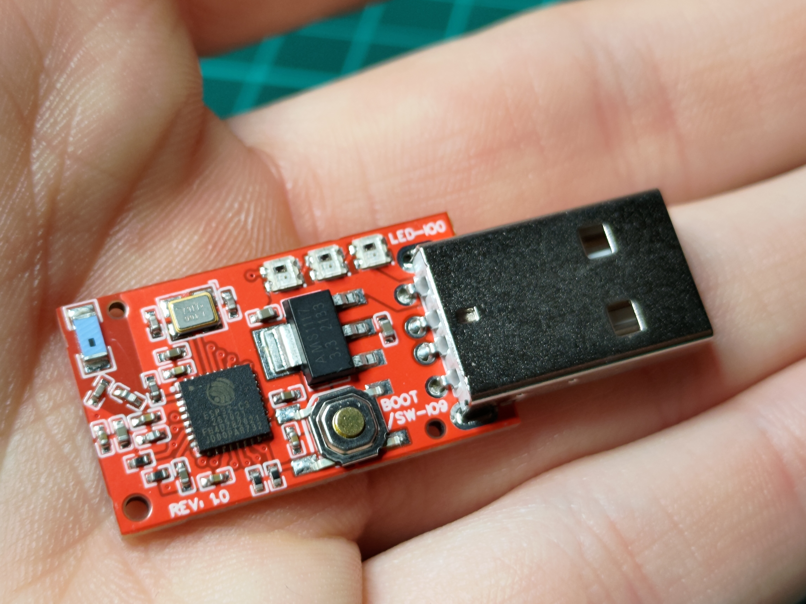
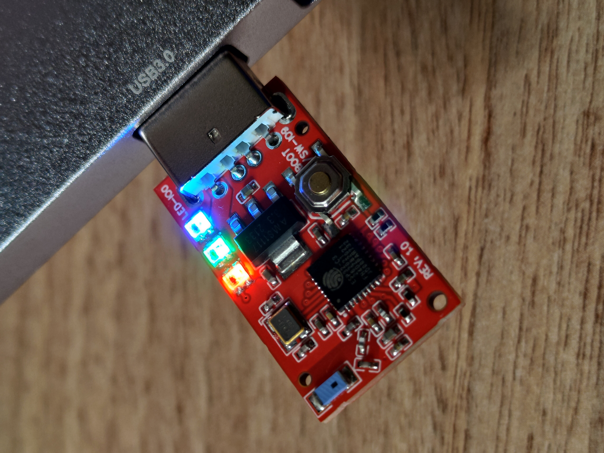

## CAPACTOR C12 IS IN WRONG POSITION AND BRINGS PARASITE CAPACITANCE TO THE PI-MATCH THUS WIFI IS NOT WORKING, ALSO SOFTWARE RESET IS UNSTABLE FOR SOME REASON

---

# DevC3
DevC3 is small, open source board (shaped as dongle) based on ESP32-C3 with MicroPython support. Its designed in [EasyEDA](https://easyeda.com/editor) and its fully assemblable in [JLCPCB assembly](https://jlcpcb.com/).
You can find it on the [OSHWLab](https://oshwlab.com/trty69230/devc3), or in this repository.







# Installing MicroPython
For now, there is not any direct port of MicroPython, but [GENERIC_C3_USB](https://github.com/micropython/micropython/tree/master/ports/esp32/boards/GENERIC_C3_USB) works perfectly! The installation process is basically:

1. Download latest firmware binary from [MicroPython website](https://micropython.org/download/esp32c3-usb/)
2. **With Python & Pip installed**, inistall [esptool.py](https://github.com/espressif/esptool) with `pip install esptool`
3. Plug board to computer with button held down (device should show as *USB JTAG/serial debug unit*)
4. Install MicroPython with:
    * clear flash: `python -m esptool --chip esp32-c3 --port /dev/ttyUSB0 erase_flash`
    * flash firmware: `python -m esptool --chip esp32c3 --port /dev/ttyUSB0 --baud 460800 write_flash -z 0x0 esp32c3.bin`
5. Reboot the board simply by taking it out and plugging it back

*Replace /dev/ttyUSB0 with your device, on Windows use COM, for example COM5, COM12, ... (can be found in device manager under Ports). This guide can be also found on the [port page](https://micropython.org/download/esp32c3-usb/).*

# Using Peripherals
You can use all libraries available in MicroPython (for example [Pin](https://docs.micropython.org/en/latest/library/machine.Pin.html) library).
There is only one problem with the [NeoPixels](https://docs.micropython.org/en/latest/esp8266/tutorial/neopixel.html) library.

As stated in [esp32-c3 port used wront rmt channel](https://github.com/micropython/micropython/issues/8109), you need to use `esp32.RMT.bitstream_channel(0)` before using NeoPixel. For Example:
```py
from machine import Pin
from neopixel import NeoPixel
from esp32 import RMT

# correct the channel error
RMT.bitstream_channel(0)

pin = Pin(0, Pin.OUT)
np = NeoPixel(pin, 3)
np[0] = (32, 0, 0)
np[1] = (0, 32, 0)
np[2] = (0, 0, 32)
np.write()
```

All Peripherals:
* WS2812 = **IO0**
* Button = **IO9**
* IO1-IO10 = On the bottom side of the board
* RX-TX = On the bottom side of the board

*GPIO2, GPIO8 and GPIO9 have on board 10KOhm pullups*
